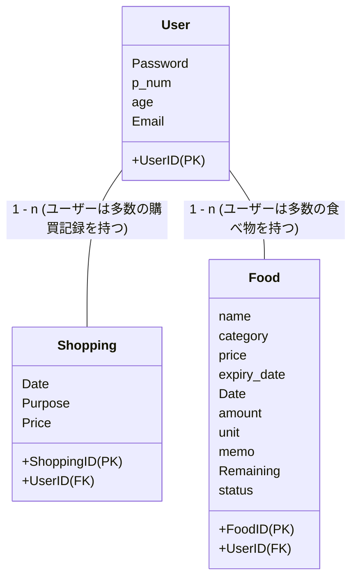

# Team-5

## 目次
- [目次](#目次)
- [frontend](#frontend)
- [SwaggerUIの起動(backend)](#swaggeruiの起動backend)
- [Dockerの使用・MySQLの確認](#dockerの使用・mysqlの確認)
    - [Command一覧](#command一覧)
    - [参考](#参考)
- [設計](#設計)
    - [テーブル図](#テーブル図)
        - [Userテーブル](#userテーブル)
        - [Foodテーブル](#foodテーブル)
        - [Shoppingテーブル](#shoppingテーブル)


## frontend
1. cd frontend
2. npm install
3. npm start

## SwaggerUIの起動(backend)
1. cd backend
2. cd be
2. pip install -r requirement.txt
3. cd api
4. uvicorn main:app --reload

## docker-compose.yamlのplatform設定
platformをM1マック用に指定してありますが、M1マック以外の方はコメントアウトしてください。
[docker-compose.yml](./docker-compose.yml)
<br>
```
platform: linux/x86_64
```

## Dockerの使用・MySQLの確認
### Command一覧
1. コンテナ起動
```
docker-compose up -d --build
```

2. コンテナ(db)に入る
```
docker exec -it db bash
```

3. mysqlへ接続
```
mysql -u root -p
Enter password:　rootpass
```

4. どんなデータベースがあるか
```
show databases;
```

5. 使用したいデータベース(sample_db)に切り替え
```
use　sample_db;
```

6. テーブル一覧
```
show tables;
```

7. テーブル(test_user)の構造確認
```
describe test_user;
```

8. テーブル(test_user)の中身確認 
```
select * from test_user;
```

### 参考
- FastAPI + MySQL + Dockerを利用したAPI開発方法
    https://qiita.com/KWS_0901/items/684ac71e728575b6eab0

- コンテナ内のデータベース閲覧
    https://qiita.com/go_glzgo/items/3520818659a07bd17839


## 設計


---

#### Userテーブル
パスワードはバックエンド側でハッシュ化して,ハッシュ化したものを保存します。

| カラム名  | 説明       | 型 | 
|---------|-----------|---------------|
| UserID  | ユーザーID (パーティションキー) | int(11) | 
| Password | ハッシュ化したパスワード   | varchar(255) |
| p_num   | 世帯数 | int(11) |
| age     | 年齢       | int(11) |
| Email | メールアドレス | varchar(255) |

---

#### Foodテーブル

| カラム名  | 説明       | 型 |
|---------|-----------|---------------|
| FoodID  | フードID (パーティションキー) | int(11) |
| UserID | ユーザーID (フォーリンキー)  | int(11) |
| name   | フードの名前 | varchar(255) |
| category     | フードのカテゴリ       | int(11) |
| price | 値段 | int(11) |
| expiry_date | 賞味期限 | date |
| Date | 購入日 | date |
| amount | 量/個数 | int(11) |
| unit | 単位 | varchar(255) |
| memo | メモ | varchar(255) |
| Remaining | 残り | int(11) |
| status | 消費したかどうかの状況(0 or 1) | int(11) |

---
#### Shoppingテーブル

| カラム名  | 説明       | 型 |
|---------|-----------|---------------|
| ShoppingID  | フードID (パーティションキー) | int(11) |
| UserID | ユーザーID (フォーリンキー)   | int(11) |
| Date   | 購入日 | date |
| Purpose     | 目的       | int(11) |
| Price | 値段 | int(11) |

----

#### Home page関連

##### GET `/get_foods`
```
// /get_foods?UserID=1
// レスポンスはリストになって返ってくる.
[
  {
    "Remaining_days": 34,
    "name": "",
    "category": 101,
    "Remaining": 5,
    "elapsed_days": 1
  },
  {
    "Remaining_days": 0,
    "name": "string",
    "category": 0,
    "Remaining": 0,
    "elapsed_days": 1
  }
]
```

----

##### GET `/get_alert_foods`
```
// /get_foods?userID=1
// レスポンスはリストになって返ってくる.
[
  {
    "Remaining_days": 0,
    "name": "string"
  },
  {
    "Remaining_days": 34,
    "name": ""
  }
]
```
